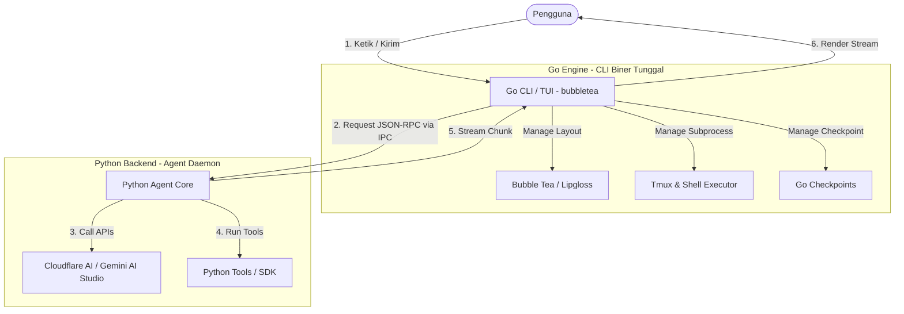

# Rencana Migrasi Arsitektur Hybrid (Go + Python)
## autokeren CLI & TUI

Dokumen ini berisi cetak biru (*blueprint*) dan rencana kerja komprehensif untuk memigrasi arsitektur **autokeren** dari 100% Python menjadi **Hybrid (Go + Python)**. Rencana ini disusun agar jelas, bersih, terstruktur, dan mudah diwariskan kepada tim pengembang lainnya.

---

## 1. Latar Belakang & Analisis Kebutuhan

Saat ini, `autokeren` ditulis sepenuhnya dalam Python. Pilihan ini memudahkan penulisan logika AI (Agentic Loop), integrasi LLM, dan manipulasi AST. Namun, terdapat beberapa limitasi kritis pada lapisan antarmuka pengguna (CLI/TUI) yang memicu kebutuhan migrasi:

### Limitasi Saat Ini (Python-Only)
* **Lag & Keandalan TUI**: Textual (Python) memakan memori cukup besar dan sangat bergantung pada threading Python. Deadlock pada sinkronisasi thread (seperti pemblokiran `evt.wait()` saat meminta konfirmasi izin) terkadang menyebabkan TUI *freeze/stuck*.
* **Startup Time**: Python VM membutuhkan waktu inisiasi saat startup. Hal ini terasa kurang responsif untuk sebuah alat bantu baris perintah (CLI).
* **Dependency & Packaging**: Pengguna harus memasang Python dan membuat virtual environment (`.venv`) atau menggunakan `pipx` yang rentan terhadap perbedaan versi Python di mesin lokal (`3.11`, `3.12`, `3.13`).

### Mengapa Hybrid (Go + Python)?
* **Go (untuk Antarmuka/Driver)**: Kompilasi biner tunggal (*single binary*) super cepat, penggunaan memori minimal, konkurensi tangguh (*goroutines & channels*), dan eksemplar TUI kelas dunia melalui **[Bubble Tea](https://github.com/charmbracelet/bubbletea)**.
* **Python (untuk Core AI/Brain)**: Mempertahankan logika pemikiran agen, integrasi model fallback, parsing AST untuk kode, dan unit test yang telah stabil.

---

## 2. Desain Arsitektur Baru

Sistem akan dibagi menjadi dua lapisan utama yang berkomunikasi melalui **Inter-Process Communication (IPC)** berbasis **JSON-RPC 2.0**:



### Spesifikasi Protokol Komunikasi (IPC JSON-RPC)
Komunikasi berjalan melalui standard input/output (stdio) atau local Unix Domain Socket (di Windows menggunakan Named Pipes).

#### A. Request dari Go ke Python (Contoh: submit task)
```json
{
  "jsonrpc": "2.0",
  "method": "agent.run",
  "params": {
    "user_input": "buat file hello.py yang cetak hello world"
  },
  "id": 1
}
```

#### B. Response Stream dari Python ke Go (Contoh: token chunk)
```json
{
  "jsonrpc": "2.0",
  "method": "ui.on_chunk",
  "params": {
    "text": "Tentu, saya "
  }
}
```

#### C. Request Konfirmasi dari Python ke Go (Contoh: permission dialog)
```json
{
  "jsonrpc": "2.0",
  "method": "ui.confirm_permission",
  "params": {
    "tool_name": "run_shell",
    "description": "jalankan shell: rm -rf tmp",
    "arguments": {"command": "rm -rf tmp"}
  },
  "id": 42
}
```

---

## 3. Peta Modul & Migrasi Kode

| Modul Python Lama | Status Setelah Migrasi | Peran / Implementasi Baru |
| :--- | :--- | :--- |
| `autokeren/cli.py` | ➡️ **Ported to Go** | Menggunakan [Cobra](https://github.com/spf13/cobra) untuk parsing perintah CLI utama dan slash commands. |
| `autokeren/tui.py` | ➡️ **Ported to Go** | Ditulis ulang menggunakan [Bubble Tea](https://github.com/charmbracelet/bubbletea) dan [Lip Gloss](https://github.com/charmbracelet/lipgloss). |
| `autokeren/agent.py` | 🔄 **Tetap di Python** | Core agen loop tetap di Python, dibungkus daemon handler JSON-RPC. |
| `autokeren/models/` | 🔄 **Tetap di Python** | Manajemen LLM routing, fallback, dan client Gemini/Cloudflare tetap di Python. |
| `autokeren/security.py` | 🔄 **Tetap di Python** | Pemindaian keamanan statis kode & verifikasi path. |
| `autokeren/tools/` | 🔄 **Tetap di Python** | Python tools dipertahankan, dipicu dari core agent. |
| `autokeren/ghost/` | ➡️ **Ported to Go** | Tmux session supervisor dipindahkan ke Go demi stabilitas process tracking. |

---

## 4. Tahapan Rilis & Pengembangan (Milestones)

Proses migrasi dibagi menjadi 4 Milestone terstruktur:

### 🚀 Milestone 1: IPC Bridge & Go CLI Driver (Minggu 1-2)
* **Goal**: Go biner dapat dipanggil, menerjemahkan perintah CLI dasar, dan memanggil Python backend sebagai subprocess secara transparan.
* **Langkah Kerja**:
  1. Inisialisasi modul Go (`go mod init github.com/autokeren/autokeren`).
  2. Implementasikan struktur CLI berbasis Cobra di Go.
  3. Buat pembungkus daemon (`daemon.py`) di Python untuk membaca standard input dan memproses JSON-RPC request.
  4. Pengujian E2E: menjalankan `autokeren "perintah"` via biner Go dan mendapatkan output lengkap dari Python backend.

### 🎨 Milestone 2: Go TUI dengan Bubble Tea (Minggu 3-5)
* **Goal**: Antarmuka TUI interaktif baru selesai dibangun dengan Bubble Tea dan respons model di-stream secara real-time.
* **Langkah Kerja**:
  1. Bangun layout terminal 3-panel menggunakan Lip Gloss (Chat Panel, Status Panel, File Explorer Panel).
  2. Implementasikan thread asinkron di Go untuk menerima stream chunk JSON-RPC (`ui.on_chunk`) dan merendernya secara real-time.
  3. Desain dialog konfirmasi izin interaktif (untuk `run_shell`/`write_file`) yang memblokir input TUI namun tidak membuat deadlock.

### 👻 Milestone 3: Ghost Agent & Vibe Features Porting (Minggu 6-7)
* **Goal**: Fitur Time-Travel, Ghost Agent (tmux), dan Loop Breaker sepenuhnya terintegrasi ke Go CLI driver.
* **Langkah Kerja**:
  1. Tulis ulang modul `GhostManager` ke Go menggunakan library `os/exec` untuk memanage sesi tmux di background secara native.
  2. Integrasikan command `/rewind` di Go CLI untuk memicu pemulihan berkas dari checkpoint lokal.
  3. Migrasikan logic `/review` dan `/security` agar Go TUI dapat memanggil backend Python untuk melakukan analisis statis berkas.

### 📦 Milestone 4: Single-Binary Packaging & E2E Testing (Minggu 8)
* **Goal**: Mengemas Python backend dan runtime ke dalam biner Go tunggal, sehingga instalasi bebas dependensi.
* **Langkah Kerja**:
  1. Gunakan perkakas seperti `PyInstaller` untuk membundel backend Python menjadi biner portabel.
  2. Gunakan `go:embed` untuk membungkus aset statis atau biner Python terkompresi di dalam biner Go.
  3. Tulis integrasi CI/CD di GitHub Actions untuk membikin build otomatis di multi-OS (Linux, macOS, Windows).

---

## 5. Panduan Manajemen Proyek & Serah Terima (Handover)

### Struktur Direktori Baru Proyek
```text
autokeren/
├── cmd/                # Kode sumber Go (CLI commands)
│   ├── root.go
│   ├── model.go
│   └── debug.go
├── ui/                 # TUI Go (Bubble Tea models & views)
│   ├── chat.go
│   ├── sidebar.go
│   └── layout.go
├── backend/            # Logika Python (dipertahankan & dibungkus daemon)
│   ├── daemon.py       # JSON-RPC entry point
│   ├── agent.py
│   ├── models/
│   └── tools/
├── scripts/            # Helper scripts (release.sh, dll)
├── pyproject.toml      # Konfigurasi dependensi Python
├── go.mod              # Konfigurasi modul Go
├── MIGRATION_PLAN.md   # Dokumen ini
└── README.md
```

### Cara Kontribusi Bagi Developer
#### A. Jika ingin mengubah TUI / Desain Terminal (Go Developer):
1. Masuk ke direktori `ui/` atau `cmd/`.
2. Ubah tata letak atau logika input TUI.
3. Jalankan `go build -o autokeren` untuk membangun aplikasi dan mengujinya.

#### B. Jika ingin menambah Tool Baru / Logika AI (Python Developer):
1. Masuk ke direktori `backend/`.
2. Tambahkan perkakas baru di `backend/tools/` atau ubah sistem prompt di `backend/prompts.py`.
3. Tambahkan unit test di `tests/` jika diperlukan.
4. Pengujian dapat langsung dijalankan dengan command `PYTHONPATH=. pytest`.

---

## 6. Build & Test Instructions (Panduan Pembangunan)

### 1. Kebutuhan Prasyarat
- Go versi 1.21 ke atas.
- Python versi 3.11 ke atas.

### 2. Membangun CLI secara Lokal
```bash
# Clone dan masuk ke repositori
git clone https://github.com/autokeren/autokeren.git
cd autokeren

# Pasang dependensi Go
go mod tidy

# Bangun biner CLI
go build -o dist/autokeren main.go

# Jalankan CLI hasil build
./dist/autokeren
```

### 3. Menjalankan Unit Test Terintegrasi
```bash
# Menjalankan test Go
go test ./...

# Menjalankan test Python
PYTHONPATH=. pytest
```
