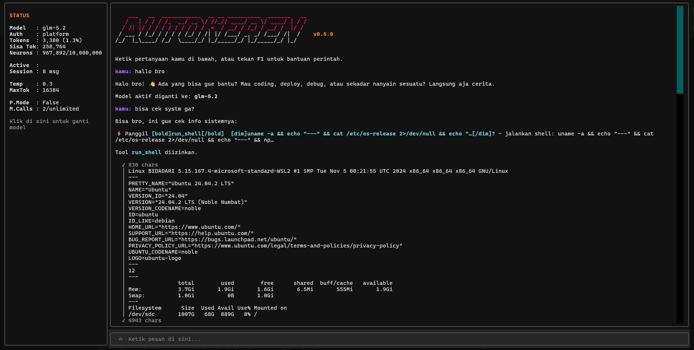

# autokeren

**Cloudflare-first agentic coding CLI dengan antarmuka TUI interaktif untuk developer Indonesia dan global.**

autokeren adalah CLI agentic coding yang dirancang khusus untuk stack Cloudflare-first. Dibangun dengan Python, autokeren menghadirkan antarmuka **Text User Interface (TUI) interaktif** yang membagi layar menjadi panel status statis dan area obrolan dinamis, mendukung 7 model AI dengan fallback otomatis, dilengkapi tools bawaan untuk file, shell, git, deploy Cloudflare, serta PaaS built-in.

[](https://github.com/autokeren/autokeren/actions/workflows/ci.yml)
[](https://opensource.org/licenses/MIT)
[](https://www.python.org/downloads/)
[](https://pypi.org/project/autokeren/)




---

## Fitur Utama

- **7 model AI** — kimi-code, kimi-2.6, glm-5.2, glm-flash, llama-4-scout, gemma-4, nemotron dengan fallback otomatis.
- **PaaS built-in** — deploy aplikasi ke Cloudflare Workers langsung dari terminal, auto D1 + R2 + AI bindings.
- **Multi-Agent Mode & Auto Spawn** — Jalankan beberapa agent secara paralel via `/project`, atau biarkan agent utama secara dinamis memanggil sub-agent menggunakan tool `spawn_agent`.
- **MCP Server Support** — Integrasikan tool eksternal pihak ketiga dengan Model Context Protocol (MCP) dan kelola via `/mcp`.
- **Input History** — Navigasi perintah sebelumnya dengan tombol arah `↑` / `↓` di terminal.
- **Export Chat** — Export seluruh riwayat percakapan menjadi file `.md` menggunakan perintah `/export`.
- **Streaming output** — respons token-by-token langsung di terminal.
- **Permission system** — konfirmasi sebelum menjalankan command berbahaya atau menulis file.
- **Cross-session memory** — ingatan per-project tersimpan otomatis, dimuat tiap startup.
- **Session save/resume** — simpan state percakapan, lanjutkan kapan saja.
- **Context tracking + /compact** — pantau pemakaian context window, ringkas otomatis atau manual.
- **AGENTS.md support** — instruksi per-project untuk AI agent dimuat otomatis.
- **Markdown rendering** — output model dirender dengan warna (heading, table, code block).
- **KV/D1/PaaS tools** — baca/tulis KV, query D1, create/deploy project langsung dari agent.
- **Tmux supervisor** — spawn dan monitor long-running agent yang survive terminal close.
- **CF Pages/Workers deploy** — helper deploy + build terintegrasi.
- **File Explorer (F7)** — toggle folder/file tree di panel kiri TUI, click file → auto baca isi.

## Vibe Coding Features (v0.8.0)

9 fitur original yang tidak ada di CLI coding tool manapun (Claude Code, Aider, Cursor, opencode, Cline):

### Time-Travel `/rewind`
Undo tool calls dan restore codebase ke checkpoint sebelumnya. Auto-checkpoint setelah setiap write/patch.
```bash
/rewind        # undo 1 tool call
/rewind 3      # undo 3 tool calls
/rewind list   # lihat semua checkpoint
```

### Architecture Guardian
Scan project genome (modules, functions, dependencies), block duplikat function/module sebelum ditulis.
```bash
/genome         # lihat project genome
/genome rescan  # rescan project
/genome check   # cek duplikat
```

### Loop Breaker
Deteksi agent stuck di loop (same error, apology loop, file thrashing). Auto-swap model.
```bash
/loop status    # lihat error history
/loop reset     # reset tracker
/loop break     # manual break — swap model + reset
```

### Cross-Model Auto-Review
Review diff dengan model dari vendor berbeda untuk catch blind spots.
```bash
/review         # review unstaged diff
/review staged  # review staged diff
```

### Vibe-Security Guard
Scan otomatis setiap file write untuk secrets, SQLi, XSS, forbidden code.
```bash
/security           # scan semua file
/security app.py    # scan file tertentu
```

### Live Architecture Enforcement
Rules-based enforcement via `.ak-rules.yaml` — max file lines, forbidden patterns, import restrictions.

### Spec-Driven Auto-Planning
AI interview user dengan 20 pertanyaan, generate plan.md + technical-plan.md.
```bash
/spec build a REST API     # mulai interview
/spec answer jawaban saya   # jawab pertanyaan
/spec generate              # generate plan
/spec show                  # lihat plan
/spec progress              # lihat progress
```

### Ghost Agent
Spawn background agent di tmux untuk parallel work.
```bash
/ghost fix bug di login.py  # spawn ghost agent
/ghost list                 # lihat semua ghost agent
/ghost show 1               # lihat output ghost #1
/ghost kill 1               # kill ghost #1
/ghost kill all             # kill semua
```

### Research Tool
Deep research ke Reddit, Hacker News, dan Web. Fetch threads + comments, LLM rangkum.
```bash
/research python coding tools     # cari semua sources
/research reddit asyncio tips     # cari Reddit saja
/research hn AI coding CLI        # cari HN saja
/research web best practices      # cari web saja
```

## Cara Mulai

### 1. Dapatkan API Key (gratis)

Daftar di **[developers.autokeren.com](https://developers.autokeren.com)** untuk dapatkan API key gratis.

### 2. Install

#### Linux / macOS

```bash
pipx install autokeren
```

> Kalau belum punya pipx: `sudo apt install pipx && pipx ensurepath` (Linux) atau `brew install pipx` (macOS)
> Alternatif: `pip install --user autokeren`

#### Windows (PowerShell)

**Langkah 1** — Install pipx via pip:

```powershell
python -m pip install --user pipx
```

**Langkah 2** — Daftarkan pipx ke PATH Windows:

```powershell
python -m pipx ensurepath
```

**Langkah 3** — Restart PowerShell (tutup dan buka kembali, wajib agar PATH terdeteksi).

**Langkah 4** — Verifikasi & pasang autokeren:

```powershell
pipx --version
pipx install autokeren
```

### 3. Login

```bash
autokeren --login
```

Masukkan API key dari developers.autokeren.com. Selesai.

### 4. Mulai ngoding

```bash
autokeren
```

## Quick Start

### Interactive TUI Chat (Default)

Menjalankan perintah tanpa argumen akan membuka antarmuka TUI interaktif:
```bash
autokeren
```

### Single prompt (Non-interactive)

```bash
autokeren "buat file hello.py yang cetak hello world"
```

### Plan mode

```bash
autokeren --plan
```

### Pilih model

```bash
autokeren -m glm "refactor fungsi ini"
autokeren -m kimi "tulis unit test untuk modul tools"
```

### Mode Google AI Studio (Gemini API)

autokeren mendukung pemanggilan model langsung ke Google AI Studio dengan API Key Anda sendiri. Cukup jalankan:
```bash
autokeren --aistudio
```
Jika API Key belum diset, Anda akan diminta memasukkannya secara interaktif dan akan disimpan secara otomatis ke `config.yaml`. Anda juga bisa menggunakan environment variable `GEMINI_API_KEY`.

### Deploy aplikasi

```bash
autokeren "deploy toko sepatu sederhana dengan HTML+CSS, pakai D1 untuk produk"
```

Agent akan otomatis create project, tulis kode, dan deploy ke Cloudflare Workers dengan D1 + R2 bindings.

### Contoh percakapan

```
> baca pyproject.toml dan tambahkan field authors
> deploy project ini ke Cloudflare Pages
> jalankan pytest dan perbaiki test yang gagal
> buat web toko sederhana, deploy langsung
> simpan preferensi build ini ke memory
```

## Model Tersedia

| Alias | Model |
|---|---|
| `kimi-code` | Moonshot Kimi K2.7-Code (primary) |
| `kimi-2.6` | Moonshot Kimi K2.6 |
| `glm-5.2` | Zai GLM 5.2 (secondary) |
| `glm-flash` | Zai GLM Flash |
| `llama-4-scout` | Meta Llama 4 Scout |
| `gemma-4` | Google Gemma 4 |
| `nemotron` | NVIDIA Nemotron |

Jalur tambahan:

| Alias | Model |
|---|---|
| `gemini-3.5-flash` | Google Gemini 3.5 Flash via AI Studio (`--aistudio`) |
| `gemini-3.5-pro` | Google Gemini 3.5 Pro via AI Studio (`--aistudio`) |

Pilih dengan `-m <alias>`. Default: `kimi-code` dengan fallback ke `glm-5.2`.

## Commands & Shortcuts

Di mode interaktif TUI, Anda dapat menggunakan tombol pintas keyboard (*hotkeys*) dan perintah slash berikut:

### Tombol Pintas Keyboard (Hotkeys)

| Tombol | Aksi | Deskripsi |
|---|---|---|
| **`F1`** | Help | Tampilkan daftar bantuan perintah dan shortcut |
| **`F2`** | Ganti Model | Memunculkan modal dialog interaktif untuk memilih model AI |
| **`F3`** | Reset Sesi | Mereset seluruh percakapan dan status izin tool |
| **`F4`** | Salin Respon | Menyalin pesan/jawaban terakhir AI ke clipboard sistem |
| **`F5`** | Compact | Meringkas riwayat context window percakapan |
| **`F6`** | Ganti Bahasa | Memunculkan modal dialog interaktif untuk memilih bahasa UI |
| **`Ctrl+C`**| Batal / Stop | Membatalkan/menghentikan eksekusi proses AI atau tool yang aktif |
| **`F7`**| File Explorer | Toggle file/folder tree di panel kiri (click file → auto baca) |

### Perintah Slash

Dapat diketik langsung di kotak input chat (mendukung *autocomplete* otomatis menggunakan tombol Tab atau Panah Kanan):

| Perintah | Deskripsi |
|---|---|
| `/help` | Tampilkan bantuan dan daftar perintah |
| `/q` atau `/quit` | Keluar dari sesi |
| `/model [nama]` | Ganti model aktif (buka modal pop-up jika nama kosong) |
| `/lang [kode]` | Ganti bahasa UI (buka modal pop-up jika kode kosong, misal: `/lang en`) |
| `/export [nama]` | Ekspor percakapan ke file Markdown (default: auto-timestamp) |
| `/copy [last\|N]` | Salin pesan ke clipboard (`last` = pesan terakhir, `N` = indeks pesan) |
| `/mcp` | Membuka manager interaktif MCP Server |
| `/project <subcommand>`| Manajemen project Multi-Agent |
| `/compact` | Ringkas history percakapan |
| `/reset` | Reset sesi percakapan saat ini |
| `/memory` | Tampilkan isi memory per-project |
| `/permissions` | Tampilkan daftar tool yang diizinkan |
| `/save [nama]` | Simpan sesi saat ini |
| `/resume <nama\|id>` | Lanjutkan sesi tersimpan |
| `/sessions` | Daftar semua sesi tersimpan |
| `/rewind [N]` | Undo N tool calls, restore ke checkpoint |
| `/rewind list` | Lihat semua checkpoint |
| `/genome` | Lihat project genome (modules, functions) |
| `/genome rescan` | Rescan project genome |
| `/genome check` | Cek duplikat function |
| `/loop status` | Lihat error history loop breaker |
| `/loop reset` | Reset loop breaker tracker |
| `/loop break` | Manual break — swap model + reset |
| `/review [staged]` | Cross-model review diff |
| `/security [file]` | Scan security issues |
| `/spec <request>` | Mulai spec interview |
| `/spec answer <text>` | Jawab pertanyaan interview |
| `/spec generate` | Generate plan.md + technical-plan.md |
| `/spec show` | Tampilkan plan |
| `/spec progress` | Lihat progress plan |
| `/ghost <task>` | Spawn background ghost agent |
| `/ghost list` | Lihat semua ghost agent |
| `/ghost show <id>` | Lihat output ghost agent |
| `/ghost kill <id\|all>` | Kill ghost agent |
| `/research <query>` | Riset ke Reddit + HN + Web |
| `/research reddit\|hn\|web <q>` | Riset ke source tertentu |
| `/deploy <deskripsi>` | Bikin app + deploy ke Cloudflare (auto create_project → write_file → deploy) |

## Tools

autokeren membawa 28 tools bawaan dengan permission check dan schema function-calling.

| Tool | Deskripsi |
|---|---|
| `read_file` | Baca isi file |
| `write_file` | Tulis file baru atau overwrite |
| `patch_file` | Patch file dengan search-and-replace |
| `list_files` | List file dalam direktori (glob pattern) |
| `run_shell` | Jalankan shell command dengan allowlist + blocklist |
| `search_code` | Cari konten file dengan regex |
| `fetch_url` | Ambil konten URL |
| `git_status` | Status working tree git |
| `git_diff` | Diff git (staged/unstaged) |
| `git_commit` | Commit perubahan |
| `git_log` | Riwayat commit git (commit logs) |
| `git_branch` | Daftar, buat, atau switch git branch |
| `cf_deploy` | Deploy ke Cloudflare Pages/Workers via wrangler |
| `cf_build_next` | Build Next.js dengan next-on-pages |
| `cf_kv` | Baca/tulis Cloudflare KV namespace |
| `cf_d1` | Jalankan query Cloudflare D1 |
| `create_project` | Buat project PaaS baru (auto D1 + R2 + AI bindings) |
| `deploy_project` | Deploy code ke project PaaS |
| `list_projects` | Daftar project PaaS yang sudah dibuat |
| `spawn_agent` | Spawn sub-agent secara dinamis untuk memparalelkan task |
| `tmux` | Supervisor long-running task via tmux |
| `todo` | Kelola todo list multi-step |
| `remember` | Simpan info ke cross-session memory |
| `rewind` | Undo tool calls, restore ke checkpoint |
| `genome` | Lihat/rescan project architecture genome |
| `review` | Cross-model code review |
| `research` | Deep research ke Reddit, HN, dan Web |
| `camofox` | Browser automation via Camofox |

## Konfigurasi

Konfigurasi disimpan di `~/.config/autokeren/config.yaml`.

```yaml
auth:
  mode: "platform"       # "platform" (default), "direct", atau "aistudio"
  api_key: ""            # API key dari developers.autokeren.com
  gemini_api_key: ""     # API Key Google AI Studio (hanya untuk mode "aistudio")

cloudflare:
  primary_model: "kimi-code"
  secondary_model: "glm-5.2"
  max_tokens: 16384
  temperature: 0.3
  timeout: 120.0

retry:
  max_retries: 5
  base_delay: 1.0
  max_delay: 60.0
  exponential_base: 2.0
  jitter: true
  circuit_failure_threshold: 5
  circuit_open_seconds: 30

autokeren:
  plan_mode: false
  max_iterations: 50
  shell_timeout: 180
  shell_allowlist: ["node", "npm", "pnpm", "npx", "git", "wrangler", "python3", "pytest"]
  project_root: "."
  context_window: 262144
  compact_tail_turns: 6
  auto_compact: false
  auto_compact_threshold: 0.8
  # Vibe coding features (v0.8.0+)
  time_travel:
    enabled: true
    max_checkpoints: 50
    auto_checkpoint: true
  architecture_guardian:
    enabled: true
    block_duplicates: true
    scan_interval: 5
  loop_breaker:
    enabled: true
    max_repeats: 3
    auto_switch_model: true
  cross_model_review:
    enabled: true
    reviewer_model: "auto"
    auto_review: false
  vibe_security:
    enabled: true
    scan_on_write: true
    block_on_critical: true
  live_enforcement:
    enabled: true
    rules_file: ".ak-rules.yaml"
    block_on_violation: true
  spec_driven:
    enabled: true
    num_questions: 20
    auto_generate: true
  ghost_agent:
    enabled: true
    max_background: 3
    tmux_prefix: "ak-ghost"
  research:
    enabled: true
    sources: ["reddit", "hackernews", "web"]
    max_results: 10
    max_depth: 3
    summarize: true

mcp_servers:
  - name: filesystem
    enabled: true
    command: ["npx", "-y", "@modelcontextprotocol/server-filesystem", "/tmp"]
    env: {}
```

### Environment variables

| Variable | Deskripsi |
|---|---|
| `AUTOKEREN_API_KEY` | API key dari developers.autokeren.com (override config) |
| `GEMINI_API_KEY` | API key Google AI Studio (Gemini API) |
| `AUTOKEREN_CONFIG_DIR` | Direktori konfigurasi custom (default `~/.config/autokeren`) |

## Update

```bash
pipx upgrade autokeren
```

## Arsitektur

```
cli.py ──> tui.py (TUI wrapper) ──> agent.py (core loop) ──> models/ (Cloudflare client + router + retry)
                                                              tools/ (Tool base + registry + 24 tools)
                                                              context.py (session memory + token tracking)
                                                              memory.py (cross-session memory)
                                                              session.py (save/resume)
                                                              ui.py (fallback Rich CLI + markdown)
```

## Contributing

Kontribusi sangat diterima. Fork, buat branch, kirim PR.

```bash
git clone https://github.com/autokeren/autokeren.git
cd autokeren
python3 -m venv .venv
source .venv/bin/activate
pip install -e ".[dev]"
```

Sebelum commit, pastikan `ruff check .`, `mypy autokeren`, dan `pytest` semua lulus.

## License

MIT — lihat [LICENSE](LICENSE).

## Disclaimer

autokeren adalah proyek independen dan **tidak berafiliasi dengan, diendorsing oleh, atau sponsori oleh Cloudflare, Inc.** "Cloudflare" serta produk terkait adalah merek dagang Cloudflare, Inc. autokeren menggunakan infrastruktur dan API publik Cloudflare (Workers AI, D1, R2, KV, Pages) sebagai layanan pihak ketiga.
